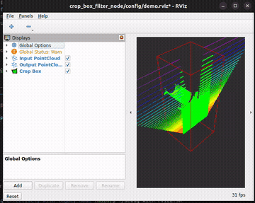

# pointcloud_crop_filter

ROS2の点群データ (`sensor_msgs/PointCloud2`) に対して、バウンディングボックスによるクロップフィルタを適用するノードです。

このパッケージは **レガシーコードのリファクタリング用サンプル** として作成されています。意図的に `rclcpp::Node` とコアロジックが密結合した設計になっており、また単体テストや結合テストが用意されていない状態になっています。

## ノード概要

| 項目 | 値 |
|---|---|
| ノード名 | `pointcloud_crop_filter` |
| Subscribe | `input` (`sensor_msgs/PointCloud2`) |
| Publish | `output` (`sensor_msgs/PointCloud2`) |
| Publish | `~/crop_box_polygon` (`geometry_msgs/PolygonStamped`) |

## パラメータ

| パラメータ名 | 型 | デフォルト | 説明 |
|---|---|---|---|
| `input_pointcloud_frame` | string | `"base_link"` | 入力点群のTFフレーム |
| `crop_box_frame` | string | `"base_link"` | クロップボックスを定義するTFフレーム |
| `max_queue_size` | int | `5` | サブスクリプションのキューサイズ |
| `min_x` | double | `-50.0` | ボックスのX最小値 [m] |
| `min_y` | double | `-50.0` | ボックスのY最小値 [m] |
| `min_z` | double | `-50.0` | ボックスのZ最小値 [m] |
| `max_x` | double | `50.0` | ボックスのX最大値 [m] |
| `max_y` | double | `50.0` | ボックスのY最大値 [m] |
| `max_z` | double | `50.0` | ボックスのZ最大値 [m] |
| `keep_outside` | bool | `false` | `true` の場合、ボックス **外側** の点群を保持する |

## ビルド

```bash
source /opt/ros/humble/setup.bash
cd ~/practice/working_effectively_with_legacy_ros2_node
colcon build --packages-select pointcloud_crop_filter
```

## 起動

```bash
source install/setup.bash
ros2 run pointcloud_crop_filter pointcloud_crop_filter_node --ros-args \
  -p input_pointcloud_frame:=base_link \
  -p crop_box_frame:=base_link \
  --remap input:=/your/pointcloud \
  --remap output:=/filtered/pointcloud
```

## rviz2 でのデバッグ

サンプルの rosbag を再生しながらノードと rviz2 を起動して、フィルタ結果を可視化できます。

```bash
# ビルド後に実行
./debug_with_rviz2.sh
```

rviz2 上には以下が表示されます:

- **Input PointCloud** — 入力点群全体 (Z軸カラー、半透明)
- **Output PointCloud (Filtered)** — クロップボックスでフィルタされた点群 (緑)
- **Crop Box** — フィルタ領域の境界 (赤ポリゴン)



## 処理の流れ

1. `input` トピックから `PointCloud2` メッセージを受信
2. `input_pointcloud_frame` と `crop_box_frame` が異なる場合、TFを用いて座標変換を適用
3. 各点の座標を `memcpy` でバイトバッファから直接読み取り、ボックス範囲内かを判定
4. 条件に合致する点のみ `memcpy` で出力バッファにコピー
5. `output` トピックにフィルタ済み点群を publish
6. `~/crop_box_polygon` トピックにクロップボックスの可視化用ポリゴンを publish

## 設計上の課題

このノードは意図的に以下の問題を含んでいます:

- **Node とフィルタロジックの密結合**: フィルタ処理が `pointcloud_callback()` に直接記述されており、ノードを起動せずに単体テストできない
- **単体テストや結合テストがない**: 自動テストができず、rviz2で表示することでしか動作確認ができない
- **TF 変換ロジックの内包**: 座標変換もノードクラスのメンバとして管理されており、分離・差し替えが困難
- **低レベルなデータアクセス**: `memcpy` によるバイトバッファ直接操作がコールバック内に展開されている
